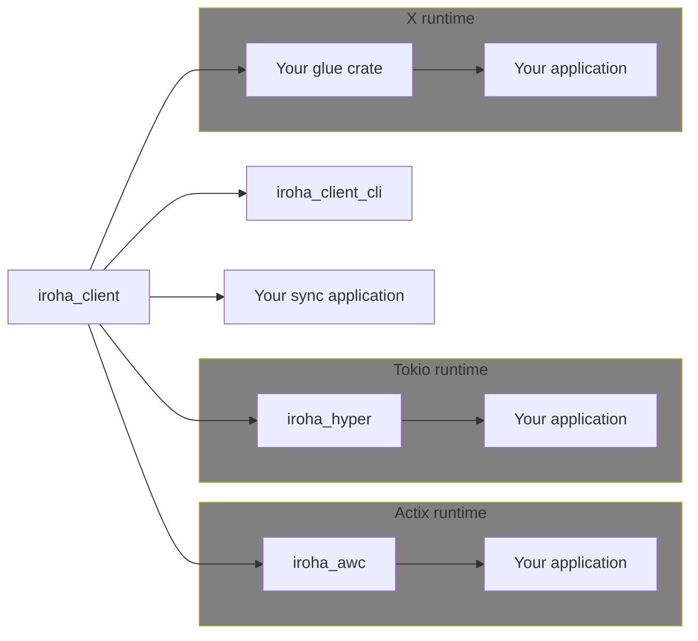

# Iroha Client

This is the Iroha 2 client library crate. With it you can build your own client applications to communicate with peers in an Iroha 2 network via HTTP/WebSocket.

Follow the [Iroha 2 tutorial](https://hyperledger.github.io/iroha-2-docs/guide/rust.html) for instructions on how to set up, configure, and use the Iroha 2 client and client library.

## Features

* Submit one or several Iroha Special Instructions (ISI) as a Transaction to Iroha Peer
* Request data based on Iroha Queries from a Peer

## Setup

**Requirements:** a working [Rust toolchain](https://www.rust-lang.org/learn/get-started) (version 1.60), installed and configured.

Add the following to the manifest file of your Rust project:

```toml
iroha_client = { git = "https://github.com/hyperledger/iroha/", branch="iroha2-dev" }
```

## Examples

```rust
let configuration =
    &Configuration::from_path("config.json").expect("Failed to load configuration.");
let mut iroha_client = Client::new(configuration);
```

We highly recommend looking at the sample [`iroha_client_cli`](../client_cli) implementation binary as well as our [tutorial](https://hyperledger.github.io/iroha-2-docs/guide/rust.html) for more examples and explanations.

## Foundation for asynchronous libraries

This crate also provides a [Future](https://doc.rust-lang.org/stable/std/future/trait.Future.html)-compatible API to create your own libraries and applications based on it.
### A glue library
The async API is runtime-agnostic so basically you just need to implement a couple of [traits](https://docs.rs/std/keyword.trait.html) to make any async-runtime compatible with the Iroha 2 client - the implementation would be a glue code between the Iroha 2 client library and your chosen transport using a specific async-runtime.
### Existing glue libraries
We provide [our own glue library](../client_awc/README) built for use in the [Actix](https://actix.rs) runtime and based on [awc](https://docs.rs/awc). We highly recommend to use this library if you use [Actix](https://actix.rs). There is [another crate](../client_hyper/README) to use in the [Tokio](https://docs.rs/tokio) runtime and built on top of [hyper](https://hyper.rs).

