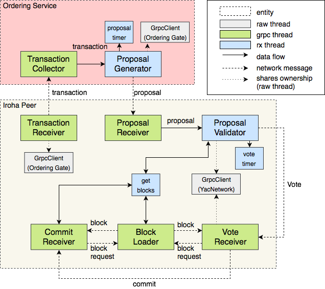

*********************
Iroha Execution Model
*********************

Introduction
============

This document describes threads and their interaction inside Iroha daemon. 
Overall configuration is presented and each thread's responsibilities are described in detail.

This is done to provide understanding in concurrency model of Iroha as well as to find any incorrect behavior in threading model.

On Thread Management
====================

Iroha daemon avoids using raw threads provided by C++ standard library. 
Instead it relies on two distinct runtimes - grpc and rxcpp. 
They use threads internally to provide necessary functionality. 
In this document we treat these libraries as black boxes, meaning we are only stating the fact that the thread from a specific runtime is used, without going into details of where this thread came from.

The only place where a raw thread is used is AsyncGrpcClient implementation, which spawns a separate thread to listen to grpc replies.

Multisignature Transaction Support
==================================

Everything described below is done with MST support turned off.

Transactions Pipeline
=====================

Transaction Diagram
-------------------

The diagram below represents thread configuration when executing transactions on Iroha network.

Each block is a separate thread, and data flow is represented by arrows.

Detailed Description
--------------------

Transaction Receiver
^^^^^^^^^^^^^^^^^^^^

Used components:

* Torii (tx processor)
* Peer Communication Service
* Ordering Gate
* This is a grpc thread which handles transactions sent by users. 
Goal is to pass the transaction to the ordering service.

Transaction Collector
^^^^^^^^^^^^^^^^^^^^^

Used components:

* Ordering Service Transport
* Ordering Service
* This grpc thread receives transactions from peers and puts them in a queue. 
Queue is processed by Proposal Generator

Proposal Generator
^^^^^^^^^^^^^^^^^^

Used components:

* Ordering Service Transport
* Ordering Service
* This is an rx thread which is triggered by two events: transactions added to the queue and proposal timeout. 
When queue is big enough or timeout event occurs, it starts proposal generation.

Proposal Timer
^^^^^^^^^^^^^^

To prevent transactions from hanging indefinitely, special timer is started, which works in a separate thread. 
As soon as timer goes off, proposal is formed from all transactions currently in the queue.

Proposal Receiver
^^^^^^^^^^^^^^^^^

Used components:

* Ordering Service Transport
* Ordering Gate
* This thread receives proposals from ordering service and puts them in a proposal queue to be validated.

Proposal Validator
^^^^^^^^^^^^^^^^^^

Used components:

* Ordering Gate
* Simulator
* Stateful Validator
* Yac (gate, order, network)

This thread takes proposal from the proposal queue and sends it for a validation. 
When proposal is validated we obtain verified proposal. 
Vote for this proposal is broadcasted to the other peers.

Vote Timer
^^^^^^^^^^

To optimize vote propagation among peers, we need to wait before sending vote to the next peer in the list. 
This is done to allow first peer to collect necessary votes to issue a commit.

Vote Receiver
^^^^^^^^^^^^^

Used components:

* Yac
* Yac Block Storage
* Vote Receiver is a thread which listens for incoming votes. 
When enough votes were received, commit message is formed and broadcasted to all the peers.

Block Loader
^^^^^^^^^^^^

Used components:

* Block Loader Service
* Block Loader
* This thread listens for requests to load blocks from the peer. 
It is called when we receive commit message and want to retrieve commited block.

Commit Receiver
^^^^^^^^^^^^^^^

Used components:

* Yac
* Commit receiver is a thread which listens for incoming commits, verifies them and passes to the pipeline to be applied.

Commit Application
^^^^^^^^^^^^^^^^^^

Used components:

* Synchronizer
* Chain Validator
* Ametsuchi

Commit is applied in a thread in which commit is obtained. 
If the peer creates commit, it is applied in Vote Receiver. 
If the peer receives commit, Commit Receiver applies it. 
Application of the commit begins with the retrieval of the block which is to be commited, then it is passed to the storage, which executes all transactions in the block.

Get Blocks
^^^^^^^^^^

In a lot of cases GetTopBlocks function is called on a separate thread, it can be a different thread each time, and this is not really needed. 
Consider this a bug. 
List of components which call getTopBlocks in a separate thread:

* Simulator
* Storage
* Block Loader

GRPC Client
^^^^^^^^^^^

Only raw thread, it listens for replies from grpc calls. 
Each component which sends grpc calls uses this client, and thus occupies a thread. 
Transaction Receiver sends transactions to ordering service and owns its own client (ordering gate transport). 
Vote Receiver sends votes, and Proposal Validator sends commits. 
Both these actions are done via YacNetwork, so both threads share ownership of YacNetwork client.

Query Pipeline
==============

Query execution in iroha is a lot simpler than transaction pipeline. When request arrives from the network it is handled by one of the grpc threads, which synchronously retrieves needed information from storage. Everything is done in a single thread.