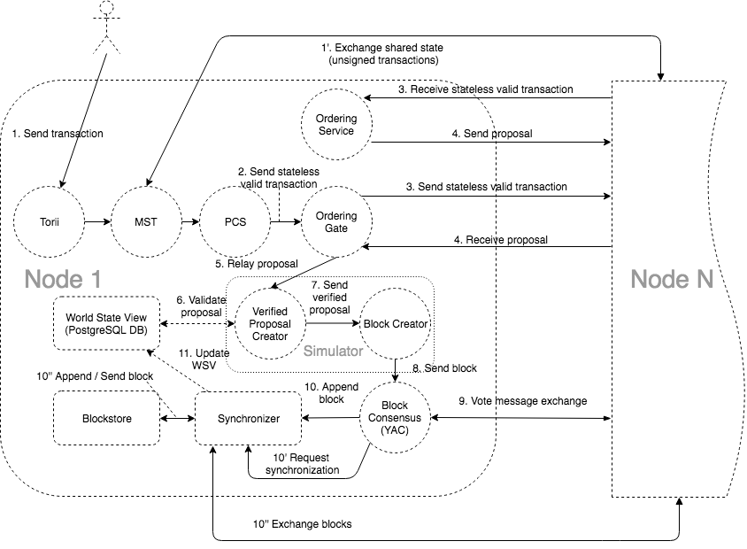

.. _architecture: 
************
Architecture
************

HL Iroha network consists of several essential components that provide the communication between the nodes. You can learn about them below.

Torii
-----

⛩

Entry point for `clients <../core_concepts/glossary.html#client>`__.
Uses gRPC as a transport.
In order to interact with Iroha anyone can use gRPC endpoints, described in `Commands <../api/commands.html>`__ and `Queries <../api/queries.html>`__ sections, or use `client libraries <../guides/libraries.html>`__.

MST Processor
-------------

*Multisignature Transactions Processor*

It is an internal gRPC service that sends and receives messages from other peers through `Gossip protocol <https://en.wikipedia.org/wiki/Gossip_protocol>`_.
Its mission is to send out `multisignature transactions <../core_concepts/glossary.html#multisignature-transactions>`_ that have not received enough signatures to reach the `quorum <../core_concepts/glossary.html#quorum>`_ until it is reached.

Peer Communication Service
--------------------------

Internal component of Iroha - an intermediary that transmits `transaction <../core_concepts/glossary.html#transaction>`__ from `Torii <#torii>`__ through `MstProcessor <#MstProcessor>`_ to `Ordering Gate <#ordering-gate>`__.
The main goal of PCS is to hide the complexity of interaction with consensus implementation.

Ordering Gate
-------------

It is an internal Iroha component (gRPC client) that relays `transactions <../core_concepts/glossary.html#transaction>`__ from `Peer Communication Service <#peer-communication-service>`__ to `Ordering Service <#ordering-service>`__.
Ordering Gate recieves `proposals <../core_concepts/glossary.html#proposal>`_ (potential blocks in the chain) from Ordering Service and sends them to `Simulator <#simulator>`__ for `stateful validation <../core_concepts/glossary.html#stateful-validation>`__.
It also requests proposal from the Ordering Service based on the consensus round.

Ordering Service
----------------

Internal Iroha component (gRPC server) that receives messages from other `peers <../core_concepts/glossary.html#peer>`__ and combines several `transactions <../core_concepts/glossary.html#transaction>`__ that have been passed `stateless validation <../core_concepts/glossary.html#stateless-validation>`__ into a `proposal <../core_concepts/glossary.html#proposal>`__.
Each node has its own ordering service.
Proposal creation could be triggered by one of the following events:

1. Time limit dedicated to transactions collection has expired.

2. Ordering service has received the maximum amount of transactions allowed for a single proposal.

Both parameters (timeout and maximum size of proposal) are configurable (check `environment-specific parameters <../guides/configuration.html#environment-specific-parameters>`_ page).

A common precondition for both triggers is that at least one transaction should reach the ordering service.
Otherwise, no proposal will be formed.

Ordering service also performs preliminary validation of the proposals (e.g. clearing out statelessly rejected transactions from the proposal).

Verified Proposal Creator
-------------------------

Internal Iroha component that performs `stateful validation <../core_concepts/glossary.html#stateful-validation>`_ of `transactions <../core_concepts/glossary.html#transaction>`__ contained in received `proposal <../core_concepts/glossary.html#proposal>`__ from the `Ordering Service <#ordering-service>`_.
On the basis of transactions that have passed stateful validation **verified proposal** will be created and passed to `Block Creator <#block-creator>`__.
All the transactions that have not passed stateful validation will be dropped and not included in a verified proposal.

Block Creator
-------------

System component that forms a block from a set of transactions that have passed `stateless <../core_concepts/glossary.html#stateless-validation>`__ and `stateful <../core_concepts/glossary.html#stateful-validation>`__ validation for further propagation to `consensus <#consensus>`__.

Block creator, together with the `Verified Proposal Creator <#verified-proposal-creator>`_ form a component called `Simulator <https://github.com/hyperledger/iroha/tree/master/irohad/simulator>`_.

Block Consensus (YAC)
---------------------

*Consensus, as a component*

    Consensus is the heart of the blockchain - it preserves a consistent state among the `peers <../core_concepts/glossary.html#peer>`__ within a peer network.
    Iroha uses own consensus algorithm called Yet Another Consensus (aka YAC).

    You can check out a video where HL Iroha maintainer thoroughly explains the principles of consensus and YAC in particular `here <https://youtu.be/mzuAbalxOKo>`__.

    Distinctive features of YAC algorithm are its scalability, performance and `Byzantine fault tolerance <https://en.wikipedia.org/wiki/Byzantine_fault_tolerance>`_.

    To ensure consistency in the network, if there are missing blocks, they will be downloaded from another peer via `Synchronizer <#synchronizer>`__.
    Committed blocks are stored in `Ametsuchi <#ametsuchi>`__ block storage.

For general definition of the consensus, please check `this link <../core_concepts/glossary.html#consensus>`_.

Synchronizer
------------

Is a part of `consensus <#consensus>`__.
Adds missing blocks to `peers' <../core_concepts/glossary.html#peer>`__ chains (downloads them from other peers to preserve consistency).

Ametsuchi Blockstore
--------------------

Iroha storage component, which stores blocks and a state generated from blocks, called `World State View <#world-state-view>`__.
There is no way for the `client <../core_concepts/glossary.html#client>`__ to directly interact with Ametsuchi.

World State View
----------------

WSV reflects the current state of the system, can be considered as a snapshot.
For example, WSV holds information about an amount of `assets <../core_concepts/glossary.html#asset>`__
that an `account <../core_concepts/glossary.html#account>`__ has at the moment but does not contain any info
history of `transaction <../core_concepts/glossary.html#transaction>`__ flow.
