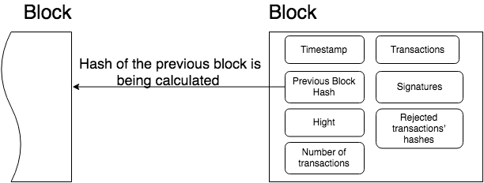

Account
=======

An Iroha entity that is able to perform specified set of actions.
Each account belongs to one of existing `domains <#domain>`__.

An account has some number of `roles <#role>`__ (can be null) — which is a collection of permissions.
Only `grantable permissions <#grantable-permission>`__ are assigned to an account directly.

Asset
=====

Any countable commodity or value.
Each asset is related to one of existing `domains <#domain>`__.
For example, an asset can represent any kind of such units - currency unit, a bar of gold, real estate unit, etc.

Block
=====

Transaction data is permanently recorded in files called blocks.
Blocks are organized into a linear sequence over time (also known as the block chain) [#f1]_.

Blocks are signed with the cryptographic signatures of Iroha `peers <#peer>`__, voting for this block during `consensus <#consensus>`__.
Signable content is called payload, so the structure of a block looks like this:

*Outside payload*

    - signatures — signatures of peers, which voted for the block during consensus round

*Inside payload*

    - height — a number of blocks in the chain up to the block
    - timestamp — Unix time (in milliseconds) of block forming by a peer
    - array of transactions, which successfully passed validation and consensus step
    - hash of a previous block in the chain
    - rejected transactions hashes — array of transaction hashes, which did not pass stateful validation step; this field is optional

Client
======

Any application that uses Iroha is treated as a client.

A distinctive feature of Iroha is that all clients are using simple client-server abstractions when they interact with a peer network: they don't use any abstractions which are specific for blockchain-related systems.
For example, in Bitcoin clients have to validate blocks, or in HL Fabric they need to poll several peers to make sure that a transaction was written in a block, whereas in HL Iroha a client interacts with any peer similarly to a single server.

Command
=======

A command is an intention to change the `state <#world-state-view>`__ of the network.
For example, in order to create a new `role <#role>`__ in Iroha you have to issue `Create role <../develop/api/commands.html#create-role>`__ command.

Consensus
=========

A consensus algorithm is a process in computer science used to achieve agreement on a single data value among distributed processes or systems.
Consensus algorithms are designed to achieve reliability in a network involving multiple unreliable nodes.
Solving that issue -- known as the consensus problem -- is important in distributed computing and multi-agent systems.

*Consensus, as an algorithm*

An algorithm to achieve agreement on a block among peers in the network. By having it in the system, reliability is increased.

For consensus as Iroha's component, please check `this link <architecture.html#block-consensus-yac>`_.

Domain
======

A named abstraction for grouping `accounts <#account>`__ and `assets <#asset>`__.
For example, it can represent an organisation in the group of organisations working with Iroha.

Peer
====

A node that is a part of Iroha network.
It participates in `consensus <#consensus>`_ process.

Permission
==========

A named rule that gives the privilege to perform a command.
Permission **cannot** be granted to an `account <#account>`__ directly, instead, account has roles, which are collections of permissions. Although, there is an exception, see `Grantable Permission <#grantable-permission>`__.

`List of Iroha permissions <../develop/api/permissions.html>`_.

Grantable Permission
--------------------

Only grantable permission is given to an `account <#account>`__ directly.
An account that holds grantable permission is allowed to perform some particular action on behalf of another account.
For example, if account a@domain1 gives the account b@domain2 a permission that it can transfer assets — then  b@domain2 can transfer assets of a@domain1 to anyone.

Proposal
========

A set of `transactions <#transaction>`__ that have passed only `stateless validation <#stateless-validation>`__.

Verified Proposal
-----------------

A set of transactions that have passed both `stateless <#stateless-validation>`__ and `stateful <#stateful-validation>`__ validation, but were not committed yet.

Query
=====

A request to Iroha that does **not** change the `state <architecture.html#world-state-view>`__ of the network.
By performing a query, a client can request data from the state, for example a balance of his account, a history of transactions, etc.

Quorum
======

In the context of transactions signing, quorum number is a minimum amount of signatures required to consider a transaction signed.
The default value is 1.
For `MST transactions <#multisignature-transactions>`__ you will need to increase that number.

Each account can link additional public keys and increase own quorum number.

Role
====

A named abstraction that holds a set of `permissions <#permission>`__.

Signatory
=========

Represents an entity that can confirm multisignature transactions for an `account <#account>`__.
It can be attached to account via `AddSignatory <../develop/api/commands.html#add-signatory>`__ and detached via `RemoveSignatory <../develop/api/commands.html#remove-signatory>`__.

Transaction
===========

An ordered set of `commands <#command>`__, which is applied to the ledger atomically.
Any non-valid command within a transaction leads to rejection of the whole transaction during the validation process.

Transaction Structure
---------------------

**Payload** stores all transaction fields, except signatures:

    - Time of creation (unix time, in milliseconds)
    - Account ID of transaction creator (username@domain)
    - Quorum field (indicates required number of signatures)
    - Repeated commands which are described in details in `commands section <../develop/api/commands.html>`__
    - Batch meta information (optional part). See `Batch of Transactions`_ for details

**Signatures** contain one or many signatures (ed25519 public key + signature)

Reduced Transaction Hash
^^^^^^^^^^^^^^^^^^^^^^^^

Reduced hash is calculated over transaction payload excluding batch meta information.
Used in `Batch of Transactions`_.

Transaction Statuses
--------------------

Hyperledger Iroha supports both push and pull interaction mode with a client.
A client that uses pull mode requests status updates about transactions from Iroha peer by sending transaction hashes and awaiting a response.
On the contrary, push interaction is performed by listening of an event stream for each transaction.
In any of these modes, the set of transaction statuses is the same:

 .. image:: ./../../image_assets/tx_status.png

.. note::
    We've written a great Medium `article about Status streaming feature in Iroha <https://medium.com/iroha-contributors/status-streaming-in-hl-iroha-5503487ffcfd>`_.
    Check it out and let us know what you think in the comments!

Transaction Status Set
^^^^^^^^^^^^^^^^^^^^^^

 - NOT_RECEIVED: requested peer does not have this transaction.
 - ENOUGH_SIGNATURES_COLLECTED: this is a multisignature transaction which has enough signatures and is going to be validated by the peer.
 - MST_PENDING: this transaction is a multisignature transaction which has to be signed by more keys (as requested in quorum field).
 - MST_EXPIRED: this transaction is a multisignature transaction which is no longer valid and is going to be deleted by this peer.
 - STATELESS_VALIDATION_FAILED: the transaction was formed with some fields, not meeting stateless validation constraints. This status is returned to a client, who formed transaction, right after the transaction was sent. It would also return the reason — what rule was violated.
 - STATELESS_VALIDATION_SUCCESS: the transaction has successfully passed stateless validation. This status is returned to a client, who formed transaction, right after the transaction was sent.
 - STATEFUL_VALIDATION_FAILED: the transaction has commands, which violate validation rules, checking state of the chain (e.g. asset balance, account permissions, etc.). It would also return the reason — what rule was violated.
 - STATEFUL_VALIDATION_SUCCESS: the transaction has successfully passed stateful validation.
 - COMMITTED: the transaction is the part of a block, which gained enough votes and is in the block store at the moment.
 - REJECTED: this exact transaction was rejected by the peer during stateful validation step in previous consensus rounds. Rejected transactions' hashes are stored in `block <#block>`__ store. This is required in order to prevent `replay attacks <https://en.wikipedia.org/wiki/Replay_attack>`__.

Pending Transactions
^^^^^^^^^^^^^^^^^^^^

Any transaction that has lesser signatures at the moment than `quorum`_ of transaction creator account is considered as pending.
Pending transaction will be submitted for `stateful validation`_ as soon as `multisignature <#multisignature-transactions>`__ mechanism will collect required amount of signatures for quorum.

Transaction that already has quorum of signatures can also be considered as pending in cases
when the transaction is a part of `batch of transactions`_ and there is a not fully signed transaction.

Batch of Transactions
=====================

Transactions batch is a feature that allows sending several transactions to Iroha at once preserving their order.

Each transaction within a batch includes batch meta information.
Batch meta contains batch type identifier (atomic or ordered) and a list of `reduced hashes <#reduced-transaction-hash>`_ of all transactions within a batch.
The order of hashes defines transactions sequence.

Batch can contain transactions created by different accounts.
Any transaction within a batch can require single or `multiple <#multisignature-transactions>`__ signatures (depends on quorum set for an account of transaction creator).
At least one transaction inside a batch should have at least one signature to let the batch pass `stateless validation`_.

You can read an article about batches on our Contributors' Page on `Medium <https://medium.com/iroha-contributors/batches-in-iroha-117614cf1e88>`__.

Atomic Batch
------------

All the transactions within an atomic batch should pass `stateful validation`_ for the batch to be applied to a ledger.

Ordered Batch
-------------

Ordered batch preserves only the sequence of transactions applying to a ledger.
All the transactions that able to pass stateful validation within a batch will be applied to a ledger.
Validation failure of one transaction would NOT directly imply the failure of the whole batch.

Multisignature Transactions
===========================

A transaction which has the `quorum`_ greater than one is considered as multisignature (also called mst).
To achieve `stateful validity <#stateful-validation>`__ the confirmation is required by the `signatories <#signatory>`__ of the creator account.
These participants need to send the same transaction with their signature.

Validation
==========

There are two kinds of validation - stateless and stateful.

Stateless Validation
--------------------

Performed in `Torii <architecture.html#torii>`__.
Checks if an object is well-formed, including the signatures.

Stateful Validation
-------------------

Performed in `Verified Proposal Creator <#verified-proposal-creator>`__.
Validates against `World State View <architecture.html#world-state-view>`__.

.. [#f1] https://en.bitcoin.it/wiki/Block
