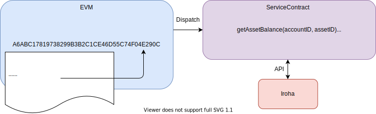

HL Burrow Integration
=====================

As Iroha maintainers, we have received many questions and requests for custom smart-contracts support from our users.
And to provide them more freedom in fulfilling their business needs, we integrated HL Burrow EVM – another great project of the Hyperledger greenhouse, into Iroha.

.. note:: In the context of Iroha, HL Burrow provides an Ethereum Virtual Machine that can run Solidity smart-contracts.
	We did our best to provide you with the best user experience possible – and to use it with Iroha, you only need to add a `CMake flag during Iroha build <../build/index.html#cmake-parameters>`_ and it will start working right away.
	
	There are official docker images built with `Hyperledger Burrow <https://hyperledger.github.io/burrow/#/>` Integration. Please replace `hyperledger/iroha:latest` with `hyperledger/iroha-burrow:latest` to use them.

You can read about Solidity smart-contract language `here <https://solidity.readthedocs.io/>`_, if you are new to this language.

How it works
------------

For this integration, we have created a special `Call Engine command <../develop/api/commands.html#call-engine>`_ in Iroha, as well as a special `Engine Receipts query <../develop/api/queries.html#engine-receipts>`_ for retrieving the results of the command.

The command
^^^^^^^^^^^

In the command, you can:

**Сreate a new contract account in EVM**

If the *callee* in the `CallEngine <../develop/api/commands.html#call-engine>`_ is not specified and the *input* parameter contains some bytecode, a new contract account is created.

**Call a method of a previously deployed contract**

If the *callee* is specified, then the input is treated as an ABI-encoded selector of a method of the callee contract followed by the arguments.

.. hint:: It is much like deploying a contract or calling a contract function in Ethereum depending on the contents of the `data` field of the `eth_sendTransaction <https://github.com/ethereum/wiki/wiki/JSON-RPC#eth_sendtransaction>`_ message call.
	See `ABI-specification <https://solidity.readthedocs.io/en/v0.6.5/abi-spec.html>`_ for details.

The query
^^^^^^^^^

To query the outcome of a `CallEngine <../develop/api/commands.html#call-engine>`_ command one should use the `Engine Receipts query <../develop/api/queries.html#engine-receipts>`_.
The output of any computations inside the EVM will not be available for the caller until it has been written to the ledger (that is, the block that has the respective Iroha transaction has been committed).
Among the other `data <../develop/api/queries.html#response-structure>`_, the *EngineReceipts* query will return an array of log entries generated in the EVM during the *CallEngine* execution.

.. hint:: A common way for dApps developers to let interested parties see the outcome of a contract execution is to emit an event with some data before exiting a contract function so that this data is written to the *Event Log*.
	`Ethereum Yellow Paper <https://ethereum.github.io/yellowpaper/paper.pdf>`_ defines a log entry as a 3-tuple containing the emitter’s address, an array of 32-byte long topics and a byte array of some data.

Passing Ordering and arguments which are list of values is being done by sending JSON string with parameters.
See examples for more examples.

Running Native Iroha Commands in EVM
^^^^^^^^^^^^^^^^^^^^^^^^^^^^^^^^^^^^

With HL Burrow integration, you can also use native commands to change the state of Iroha.

The integration mechanism of Burrow EVM empowers Iroha application developers with a tool able to directly act on the Iroha state from smart contracts code thus providing foundation for programmable business logic extensions of the built-in Iroha commands system.
Conditional asset transfers, transaction fees, non-fungible assets and so on are just a few examples of such extensions.
The tricky part here is that the Iroha data model is quite different from that of Ethereum.
For instance, in Ethereum there is only one kind of built-in asset (`Eth`) therefore getting an account balance in EVM context simply means returning the balance property of the account.
In Iroha, on the other hand, an account can have multiple assets, or not have assets at all, so any function that returns an account balance must take at least one extra argument – the asset ID.
Same logic applies to transferring/sending assets from account to account.

As a solution to this data model mismatch problem we introduce so-called Service Contracts in Burrow that are “aware” of the Iroha data model and expose an API to interact with Iroha state (query balances, transfer assets and so on).

.. note:: You can check out `Burrow documentation <https://wiki.hyperledger.org/display/burrow/Burrow+-+The+Boring+Blockchain>`_ for more information on Natives and external dispatchers.

Schematically the interaction between different parts of the system looks as follows:

.. attention::
	From the Burrow EVM perspective such Service Contract is hosted in a Native external VM and is callable via the same interfaces as if it was deployed at some special address in the EVM itself.
	These methods are used specifically for Iroha integration, so the address of the Service Contract can only be found while working with it via Iroha.

Current release of the Iroha EVM wrapper contains a single service contract deployed at the address `A6ABC17819738299B3B2C1CE46D55C74F04E290C` (the last 20 bytes of the *keccak256* hash of the string *ServiceContract*) which exposes the following Iroha commands and queries:

.. list-table:: Integrated Commands/Queries
   :widths: 3 35 35
   :header-rows: 1

   * - S No.
     - Signature of exposed API methods
     - Arguments
   * - 1
     - `addAssetQuantity(string,string) <../develop/api/commands.html#add-asset-quantity>`_
     - asset_id, amount
   * - 2 
     - `addPeer(string,string) <../develop/api/commands.html#add-peer>`_
     - address, peer_key
   * - 3 
     - `addSignatory(string,string) <../develop/api/commands.html#add-signatory>`_
     - account_id, public_key
   * - 4 
     - `appendRole(string,string) <../develop/api/commands.html#append-role>`_
     - account_id, role_name
   * - 5 
     - `createAccount(string,string,string) <../develop/api/commands.html#create-account>`_
     - account_name, domain_id, public_key
   * - 6 
     - `createAsset(string,string,string) <../develop/api/commands.html#create-asset>`_
     - asset_name, domain_id, precision
   * - 7 
     - `createDomain(string,string) <../develop/api/commands.html#create-domain>`_
     - domain_id, default_role
   * - 8 
     - `detachRole(string,string) <../develop/api/commands.html#detach-role>`_
     - account_id, role_name
   * - 9 
     - `removePeer(string) <../develop/api/commands.html#remove-peer>`_
     - public_key
   * - 10 
     - `removeSignatory(string,string) <../develop/api/commands.html#remove-signatory>`_
     - account_id, public_key
   * - 11 
     - `setAccountDetail(string,string,string) <../develop/api/commands.html#set-account-detail>`_
     - account_id, key, value
   * - 12 
     - `setAccountQuorum(string,string) <../develop/api/commands.html#set-account-quorum>`_
     - account_id, quorum
   * - 13 
     - `subtractAssetQuantity(string,string) <../develop/api/commands.html#subtract-asset-quantity>`_
     - asset_id, amount 
   * - 14 
     - `transferAsset(string,string,string,string,string) <../develop/api/commands.html#transfer-asset>`_
     - src_account_id, dest_account_id, asset_id, description, amount
   * - 15 
     - `getAccount(string) <../develop/api/queries.html#get-account>`_
     - account_id 
   * - 16 
     - `getBlock(string) <../develop/api/queries.html#get-block>`_
     - height
   * - 17 
     - `getSignatories(string) <../develop/api/queries.html#get-signatories>`_
     - account_id
   * - 18 
     - `getAssetBalance(string,string) <../develop/api/queries.html#get-account-assets>`_
     - account_id, asset_id
   * - 19 
     - `getAccountDetail() <../develop/api/queries.html#get-account-detail>`_
     -	 
   * - 20
     - `getAssetInfo(string) <../develop/api/queries.html#get-asset-info>`_
     - asset_id
   * - 21 
     - `getRoles() <../develop/api/queries.html#get-roles>`_
     -	 
   * - 22 
     - `getRolePermissions(string) <../develop/api/queries.html#get-role-permissions>`_
     - role_id
   * - 23 
     - `getPeers() <../develop/api/queries.html#get-peers>`_
     -	 

.. hint:: From a developer’s perspective calling a function of a native contract is no different from calling a method of any other smart contract provided the address of the latter is known:

	bytes memory payload = abi.encodeWithSignature("getAssetBalance(string,string)", "myacc@test", "coin#test");

	(bool success, bytes memory ret) = address(0xA6ABC17819738299B3B2C1CE46D55C74F04E290C).delegatecall(payload);

Here a special kind of EVM message calls is used - the **delegatecall**, which allows a contract to dynamically load and run code from a different address at runtime in its own execution context.

.. seealso:: Now, let's move to the usage `examples <burrow_example.html>`_

